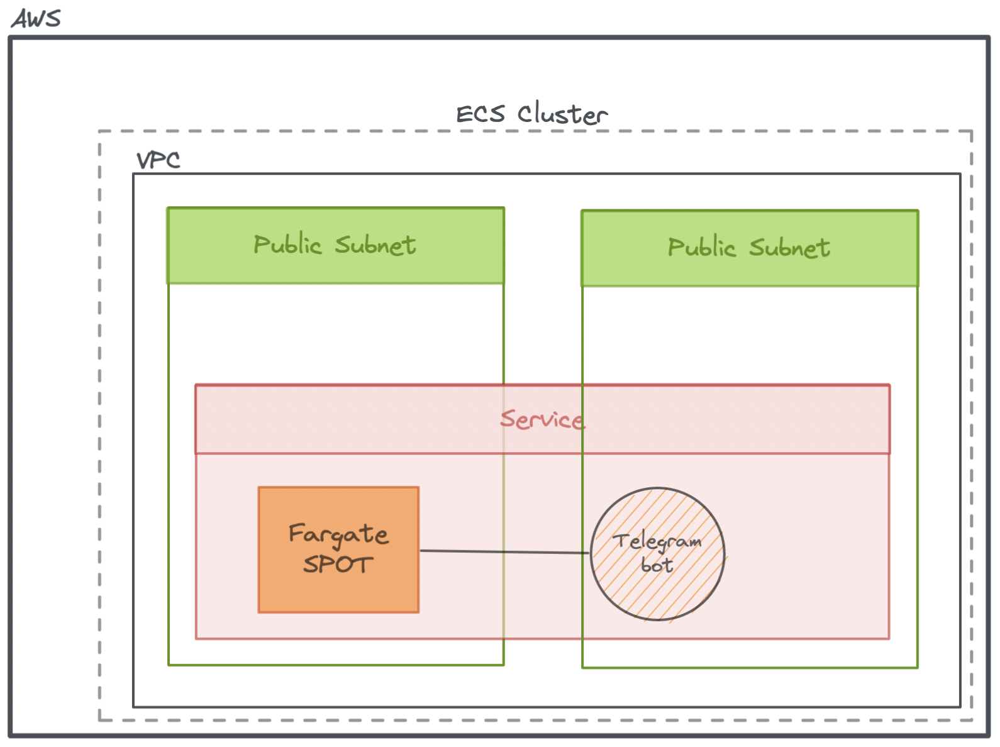
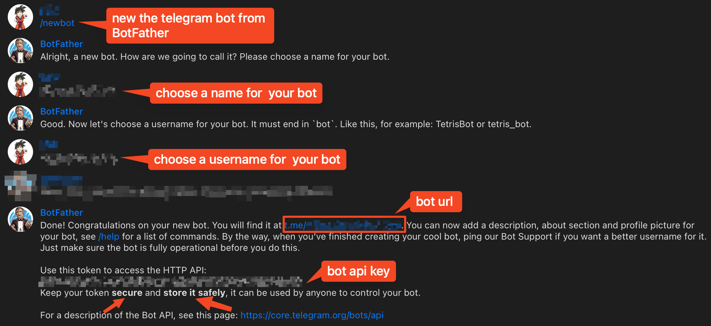

# Telegram bot example deploy via AWS CDK


## Init
- Create a telegram bot from `botFather`, and get the `HTTP_TOKEN`.


- export `API_KEY` in your shell 
```bash
export API_KEY=1234456789:xxxxxxxxxxxxxxxxxxxxxxxxxxxx
```

# Local testing
```bash
$ cd bot

$ python -m venv venv

$ source venv/bin/activate

(venv)$ python index.py 
```


# Deploy to AWS Cloud via Github pipeline
- feature:
    - Fargate spot save your money
    > `aws ecs describe-tasks --region ${REGION} --task ${TASK_ID} --cluster telegram-bot | grep capacityProviderName`
    > "capacityProviderName": "FARGATE_SPOT"

## To Install
```bash
yarn
```

## local testing
```bash
yarn build
```